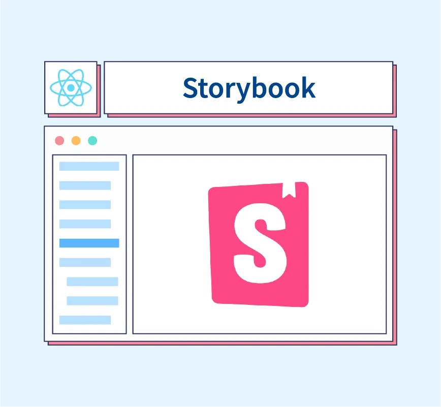
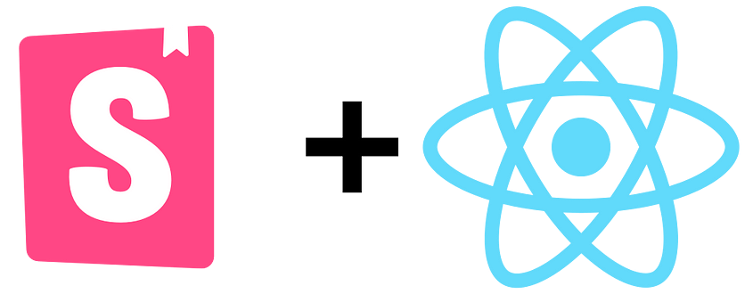

import { Meta, Story, Canvas } from "@storybook/addon-docs/blocks";

<Meta title="Introduction/Welcome" />

# Welcome to My Storybook Component Library 🌟

## Discover My Journey with Storybook

Hello! I’m excited to present my Storybook Component Library, a project born from my passion to learn and master Storybook as a powerful tool for building and showcasing UI components. This library not only demonstrates my ability to utilize advanced frontend technologies but also serves as a portfolio to potential employers looking to understand my skills and capabilities in real-world applications.



### Why This Project?

Through this project, I aimed to:

- **Deepen my understanding** of React component development.
- **Leverage Storybook** to create an interactive and visually appealing component catalog.
- **Showcase my skills** to potential employers and collaborators by documenting my learning curve and project development process.

## My Tech Stack

This project was built using a robust set of technologies chosen for their popularity, performance, and relevance in modern web development:



- **React**: Utilized for its powerful component-based architecture.
- **Storybook**: Chosen for its excellent UI component visualization and testing capabilities.
- **CSS/SASS**: Employed to style components elegantly and responsively.

## Installation

To explore my component library, start by installing the package:

```bash
npm install my-storybook-library_v2
```

## Running Storybook Locally

Visualize and interact with the components by running Storybook on your local machine:

```bash
npm run storybook
```

## Contributing and Feedback

I warmly welcome contributions and feedback. If you have suggestions or would like to contribute, please fork the repository and submit a pull request, or drop me a message.

## Connect With Me

Interested in learning more about my work or discussing potential opportunities? Let’s connect! Follow me on GitHub and reach out to discuss how we can collaborate on exciting new projects.

##### Thank you for exploring my Storybook Component Library. I hope it provides a clear insight into my technical skills and a glimpse of my potential as a valuable team member in your organization!
